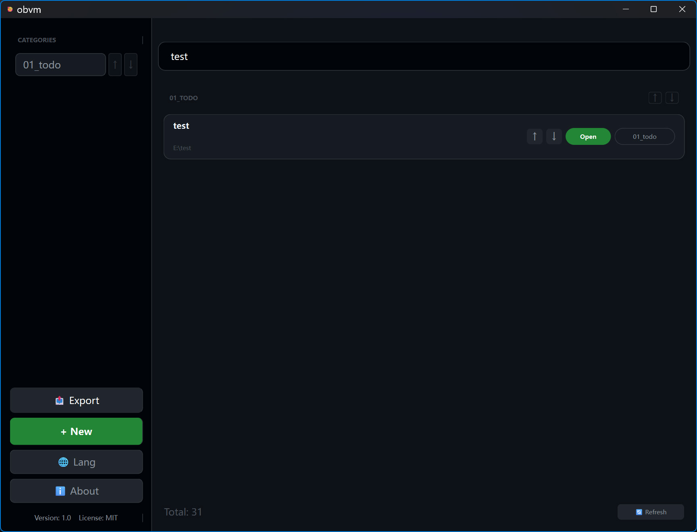

# Obsidian-Vault-Mapper
> [zh-CN：图形化的 ob 仓库启动器，便于分类管理和打开仓库](README-zh.md)

## Introduction
- A PySide6-based GUI tool for Obsidian vault management featuring a GitHub Dark theme.

## Usage
- Manage categories via sidebar; use the main panel for pinning, searching, 和 reordering. Supports exporting the entire vault index as a Markdown file. Launches vaults through the obsidian:// protocol via double-click or button.

## Technical Logic
- Read-only parsing of %APPDATA%/obsidian/obsidian.json for indexing without modifying any original data. Stores categorization data in a local vault_master.json.
## image

- 

# TODO

- [ ] add vault 

